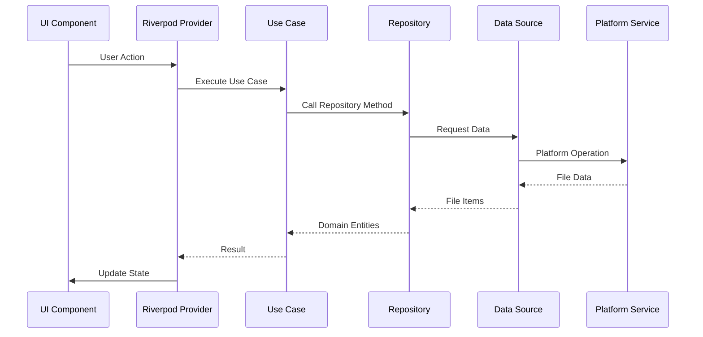
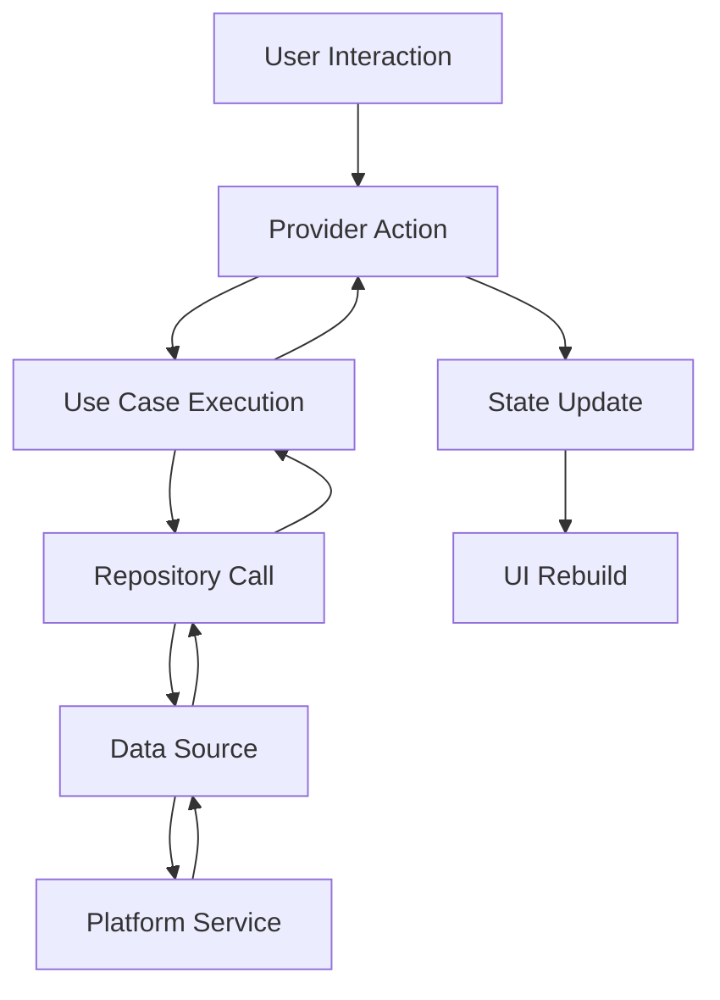

# Data Flow Documentation

This document describes how data flows through the Local File Manager application.

## Data Flow Diagram

## Example: Browsing a Directory

1. **User Action**: User taps on a directory or the ".." parent directory entry in the file browser
2. **Provider**: `FileBrowserNotifier` receives the action
   - If ".." was tapped, `getParentPath()` calculates the parent directory path
3. **Use Case**: `BrowseDirectory` is executed with the directory path
4. **Repository**: `FileRepository.listFiles()` is called
5. **Data Source**: `LocalFileDataSource.listFiles()` delegates to platform service
6. **Platform Service**: `PlatformFileService.listFiles()` performs the actual file system operation
7. **Response Flow**: Data flows back through the layers as domain entities
8. **UI Update**: Provider updates state, UI rebuilds with new file list
   - If not at root, a ".." entry is prepended to the file list for parent navigation

## State Management Flow

## Error Handling Flow

Errors are handled at each layer:

1. **Platform Service**: Catches platform-specific errors, converts to exceptions
2. **Data Source**: Handles data-related errors
3. **Repository**: Wraps errors in domain exceptions
4. **Use Case**: Provides business context to errors
5. **Provider**: Updates state with error information
6. **UI**: Displays user-friendly error messages

