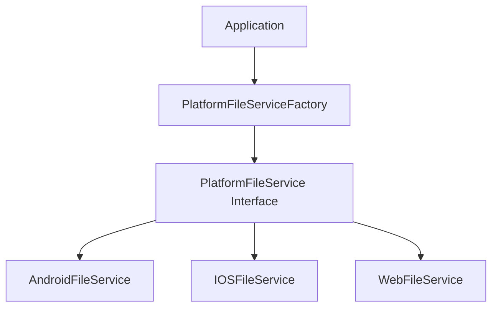

# Platform Abstraction Layer

The platform abstraction layer provides a unified interface for file operations across different platforms.

## Architecture



## Platform Services

### AndroidFileService
- **Implementation**: Uses Storage Access Framework (SAF) and standard file I/O
- **Features**: Full file system access within SAF constraints
- **Limitations**: Requires user permission for external storage

### IOSFileService
- **Implementation**: Uses UIDocumentPicker and NSFileCoordinator
- **Features**: App sandbox access and document picker integration
- **Limitations**: Limited to app sandbox and user-selected locations

### WebFileService
- **Implementation**: Stub implementation
- **Features**: Limited functionality for UI inspection
- **Limitations**: Web browsers don't allow direct file system access

## Factory Pattern

The `PlatformFileServiceFactory` automatically selects the correct implementation:

```dart
PlatformFileService service = PlatformFileServiceFactory.create();
```

The factory detects the platform at runtime and returns the appropriate service.

## Benefits

1. **Unified API**: Same interface across all platforms
2. **Easy Testing**: Can mock the interface for unit tests
3. **Platform Independence**: Business logic doesn't depend on platform specifics
4. **Maintainability**: Platform-specific code is isolated

