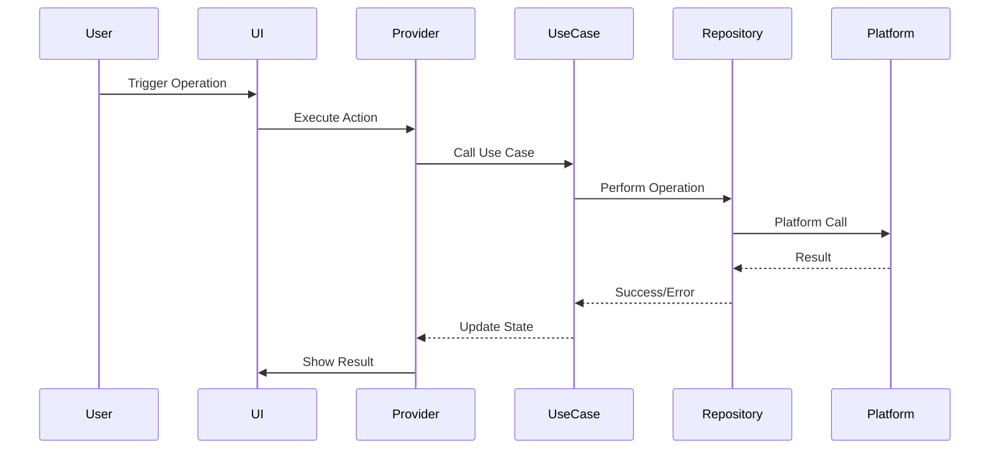

# File Operations Documentation

This document describes file operations available in Local File Manager.

For information about directory navigation and browsing, see [Navigation Documentation](navigation.md).

## Supported Operations

### Create Folder
Creates a new directory at the specified path.

**Implementation**: Uses platform service `createDirectory()`

**Error Handling**: Throws exception if directory already exists or creation fails

### Rename
Renames a file or directory.

**Implementation**: Uses platform service `renameFile()`

**Parameters**:
- Current path
- New name

### Delete
Deletes a file or directory (with confirmation).

**Implementation**: Uses platform service `deleteFile()`

**Safety**: Requires user confirmation for destructive operations

### Copy
Copies a file or directory to a new location.

**Implementation**: Uses platform service `copyFile()`

**Recursive**: Directories are copied recursively

### Move
Moves a file or directory to a new location.

**Implementation**: Uses platform service `moveFile()`

**Note**: More efficient than copy + delete

## Operation Flow

## Error Handling

All operations include comprehensive error handling:
- Permission errors
- File not found errors
- Disk space errors
- Network errors (for future cloud support)

## User Feedback

Operations provide user feedback:
- Loading indicators during operations
- Success messages
- Error messages with actionable information
- Progress indicators for long operations

