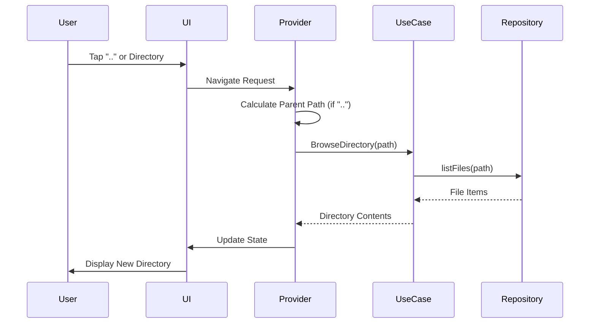

# Navigation Documentation

This document describes navigation features in Local File Manager.

## Directory Navigation

### Browsing Directories
Users can navigate through the file system by tapping on directories. The file browser displays the contents of the current directory, including files and subdirectories.

### Parent Directory Navigation

The file browser includes a special ".." (parent directory) entry that appears at the top of the file list when not at a root directory. This allows users to navigate up one level in the directory hierarchy.

**Visual Representation**:
- The ".." entry uses a distinct folder icon (`Icons.folder_outlined`) to differentiate it from regular directories
- It appears as the first item in both list and grid views
- The entry is labeled as ".." following standard file system conventions

**Behavior**:
- Only appears when a parent directory exists (not at root)
- Clicking ".." navigates to the parent directory
- Works in both list and grid view modes

**Implementation**:
- The parent path is calculated using `FileBrowserNotifier.getParentPath()`
- A pseudo `FileItem` with name ".." is prepended to the file list
- Navigation is handled through the same mechanism as regular directory navigation

## Navigation Flow

## Path Calculation

The parent directory path is calculated using the following logic:

1. **Path Normalization**: Trailing slashes are removed
2. **Root Detection**: Empty paths or "/" are treated as root (no parent)
3. **Parent Extraction**: The last path component is removed to get the parent
4. **Edge Cases**:
   - Single-level paths (e.g., "/folder") have parent "/"
   - Root paths return `null` (no ".." entry shown)
   - Empty paths return `null`

## Breadcrumb Navigation

In addition to the ".." entry, the app provides breadcrumb navigation showing the current path. Users can:
- Click on any breadcrumb segment to navigate to that directory
- Use the back arrow button to navigate to the parent directory

## View Modes

Navigation works consistently across both view modes:
- **List View**: ".." appears as the first list item
- **Grid View**: ".." appears as the first grid item

Both views use the same navigation logic and visual styling for the parent directory entry.

