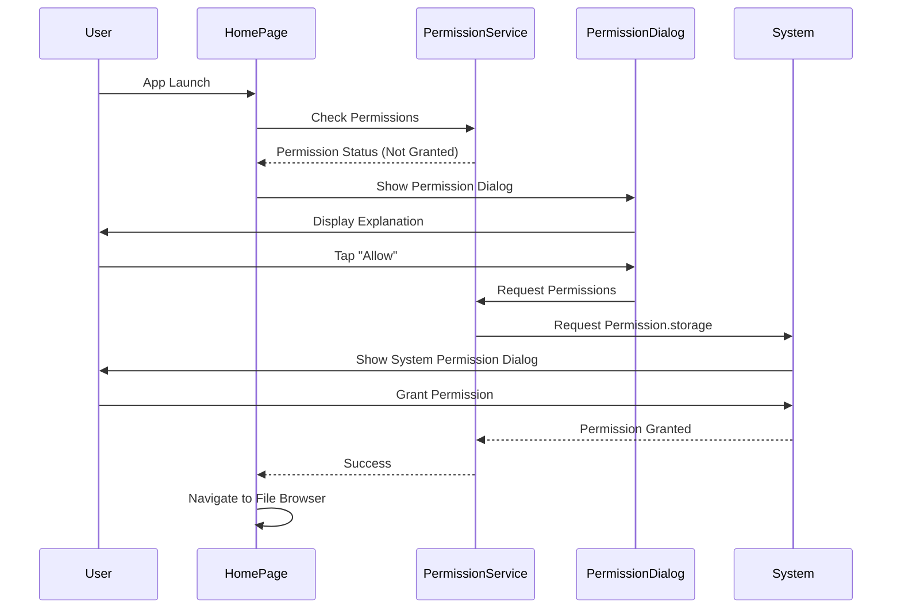
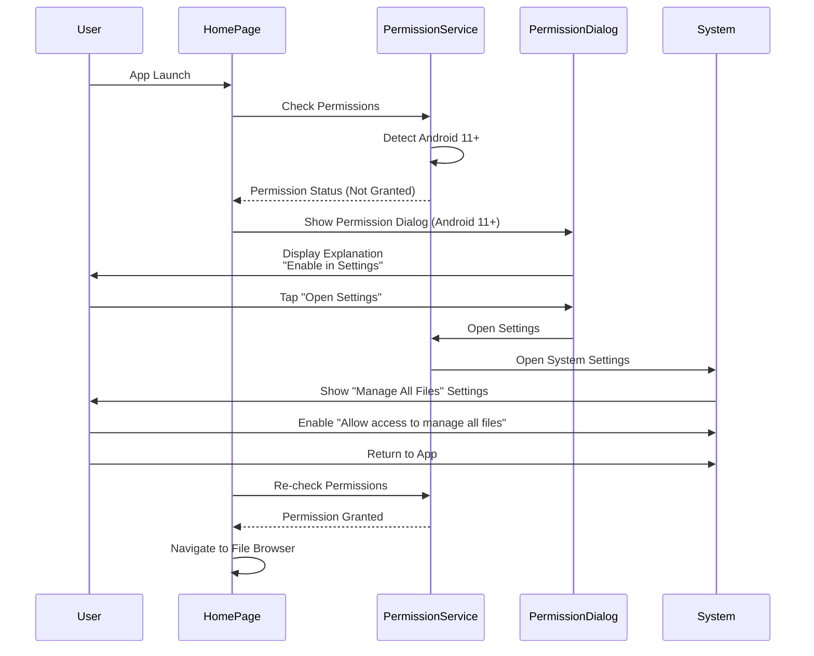

# Permissions Documentation

This document describes the permission handling system in Local File Manager.

## Overview

Local File Manager requests storage permissions on app launch to enable file browsing and management. The permission flow follows standard mobile app patterns with clear explanations and user-friendly dialogs.

## Permission Flow

### Android 9-10 Flow



### Android 11+ Flow



## Implementation

### Permission Service

The `PermissionService` class provides a platform-agnostic interface for permission handling:

- **Location**: `lib/data/services/permission_service.dart`
- **Key Methods**:
  - `checkStoragePermission()`: Checks if storage permissions are granted
  - `requestStoragePermission()`: Requests storage permissions (Android 9-10 only; Android 11+ returns status check)
  - `isPermissionPermanentlyDenied()`: Checks if permissions are permanently denied
  - `needsSettingsAccess()`: Checks if user needs to enable permission in settings (Android 11+)
  - `openSettings()`: Opens app settings
  - `openManageAllFilesSettings()`: Opens system settings for managing all files (Android 11+)
- **Auto-detection**: Automatically detects Android version and uses appropriate permission handling

### Platform-Specific Behavior

#### Android

**Android 9-10 (API 28-29)**:
- Uses `Permission.storage` (covers both READ and WRITE)
- Can be requested programmatically via standard permission dialog
- Permissions appear in app settings after granting

**Android 11+ (API 30+)**:
- Uses `Permission.manageExternalStorage`
- **Cannot be requested programmatically** - must be enabled manually in system settings
- App detects Android 11+ and guides users to system settings
- Users must enable "Allow access to manage all files" in Settings > Apps > [App Name] > Permissions
- Auto-detection: Automatically detects Android version and uses appropriate permission flow

#### iOS

- **No runtime permissions required**: iOS uses UIDocumentPicker which handles permissions internally
- **Always returns true**: Permission checks always succeed on iOS

#### Web

- **No permissions required**: Web platform doesn't need storage permissions
- **Always returns true**: Permission checks always succeed on web

### Use Cases

#### CheckPermissions

- **Location**: `lib/domain/usecases/check_permissions.dart`
- **Purpose**: Check if storage permissions are currently granted
- **Returns**: `Future<bool>` - true if granted, false otherwise

#### RequestPermissions

- **Location**: `lib/domain/usecases/request_permissions.dart`
- **Purpose**: Request storage permissions from the user
- **Returns**: `Future<bool>` - true if granted, false otherwise

### UI Components

#### PermissionDialog

- **Location**: `lib/presentation/widgets/permission_dialog.dart`
- **Purpose**: Display permission request dialog with explanation
- **Features**:
  - Clear explanation of why permissions are needed
  - Platform-aware messaging (different for Android 9-10 vs 11+)
  - **Android 9-10**: "Allow" button to request permissions programmatically
  - **Android 11+**: "Open Settings" button to navigate to system settings
  - "Cancel" button to dismiss (will reappear if permissions not granted)

#### PermissionDeniedDialog

- **Location**: `lib/presentation/widgets/permission_dialog.dart`
- **Purpose**: Display dialog when permissions are permanently denied
- **Features**:
  - Explanation that permissions are required
  - "Open Settings" button to navigate to app settings
  - "Cancel" button to dismiss

## User Experience

### First Launch

**Android 9-10:**
1. App launches and shows loading indicator
2. Permission check runs automatically
3. If permissions not granted, permission dialog appears
4. User taps "Allow" to grant permissions
5. System permission dialog appears
6. After granting, app navigates to file browser

**Android 11+:**
1. App launches and shows loading indicator
2. Permission check runs automatically
3. App detects Android 11+ and shows special dialog
4. Dialog explains that user must enable permission in system settings
5. User taps "Open Settings"
6. System settings open to "Manage all files" permission
7. User enables "Allow access to manage all files"
8. User returns to app
9. App re-checks permissions and navigates to file browser

### Permission Denial

**Android 9-10:**
1. If user denies permission:
   - Dialog reappears on next launch
   - User can retry or dismiss

2. If user permanently denies (Don't ask again):
   - Settings dialog appears
   - User can open app settings to manually grant
   - App checks permissions again after returning from settings

**Android 11+:**
1. If user doesn't enable permission in settings:
   - Dialog reappears on next launch
   - User is guided to settings again

2. App continuously checks permission status:
   - After returning from settings, app re-checks
   - If enabled, navigates to file browser
   - If not enabled, shows dialog again

### Permission Already Granted

- App checks permissions on launch
- If already granted, navigates directly to file browser
- No dialog shown

## Error Handling

- **Permission denied**: Shows dialog with retry option
- **Permanently denied**: Shows dialog with option to open settings
- **Platform errors**: Handled gracefully with user-friendly messages

## Configuration

### Android Manifest

Required permissions are declared in `android/app/src/main/AndroidManifest.xml`:

```xml
<uses-permission android:name="android.permission.READ_EXTERNAL_STORAGE" android:maxSdkVersion="32" />
<uses-permission android:name="android.permission.WRITE_EXTERNAL_STORAGE" android:maxSdkVersion="32" />
<uses-permission android:name="android.permission.MANAGE_EXTERNAL_STORAGE" tools:ignore="ScopedStorage" />
```

**Important Notes:**
- `READ_EXTERNAL_STORAGE` and `WRITE_EXTERNAL_STORAGE` are limited to Android 9-10 (maxSdkVersion="32")
- `MANAGE_EXTERNAL_STORAGE` is for Android 11+ and requires special handling
- Permissions must be declared in the manifest for the app to request them

### iOS

No runtime permissions required. File access is handled through UIDocumentPicker.

## Root Directory Access

The app no longer attempts to access the root directory (`/`) directly, which would require special permissions. Instead:

- Uses `repository.getRootDirectories()` to get accessible directories
- Accesses app-specific directories (always available)
- Accesses external storage directories (with proper permissions)
- Uses Storage Access Framework (SAF) for additional directories when needed

This ensures the app works correctly even without root-level access permissions.

## Testing

To test permission flows:

**Android 9-10:**
1. **First launch**: Uninstall and reinstall app to test first-time permission request
2. **Permission denial**: Deny permissions and verify dialog reappears
3. **Permanent denial**: Deny with "Don't ask again" and verify settings dialog
4. **Permission grant**: Grant permissions and verify navigation to file browser
5. **Verify in settings**: Check that permissions appear in App Settings > Permissions

**Android 11+:**
1. **First launch**: Uninstall and reinstall app to test first-time permission flow
2. **Settings navigation**: Verify that tapping "Open Settings" opens system settings
3. **Permission enable**: Enable "Allow access to manage all files" in settings
4. **Return to app**: Verify app detects permission and navigates to file browser
5. **Permission check**: Verify permission status is checked correctly
6. **Verify in settings**: Check that "Manage all files" permission appears in system settings

## Future Enhancements

- Optional: Add permission status indicator in settings
- Optional: Add option to request permissions from settings screen
- Optional: Add analytics for permission grant/denial rates (if needed)

