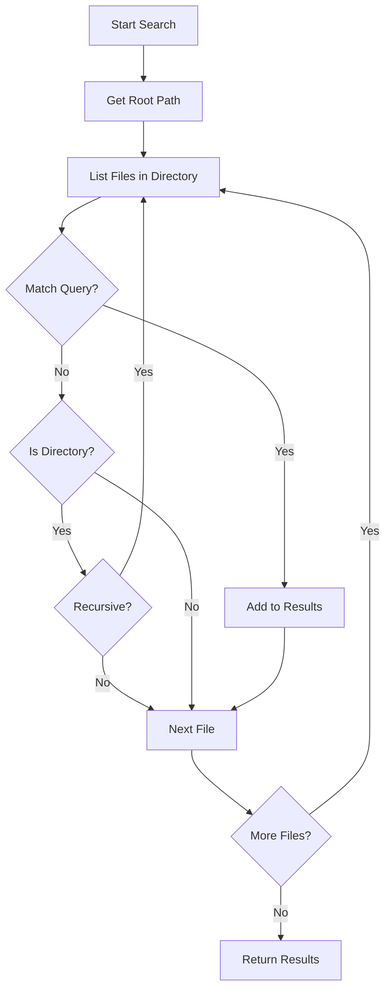

# Search Functionality Documentation

This document describes the search functionality in Local File Manager.

## Search Features

### Filename Search
- Case-insensitive matching
- Partial matching (contains)
- Recursive search through subdirectories

### Implementation

The search is implemented in `LocalFileDataSource.searchFiles()`:

```dart
Future<List<FileItem>> searchFiles({
  required String query,
  required String rootPath,
  bool recursive = true,
})
```

## Search Algorithm



## Search Process

1. **Input**: User enters search query
2. **Debounce**: Input is debounced to avoid excessive searches
3. **Recursive Traversal**: Search through directories recursively
4. **Matching**: Compare filenames (case-insensitive)
5. **Results**: Return matching files

## Performance Considerations

- **Debouncing**: Prevents excessive searches while typing
- **Async**: Search runs asynchronously to avoid blocking UI
- **Cancellation**: Search can be cancelled if new query is entered

## Future Enhancements

- File content search
- Advanced filters (date, size, type)
- Search history
- Saved searches

