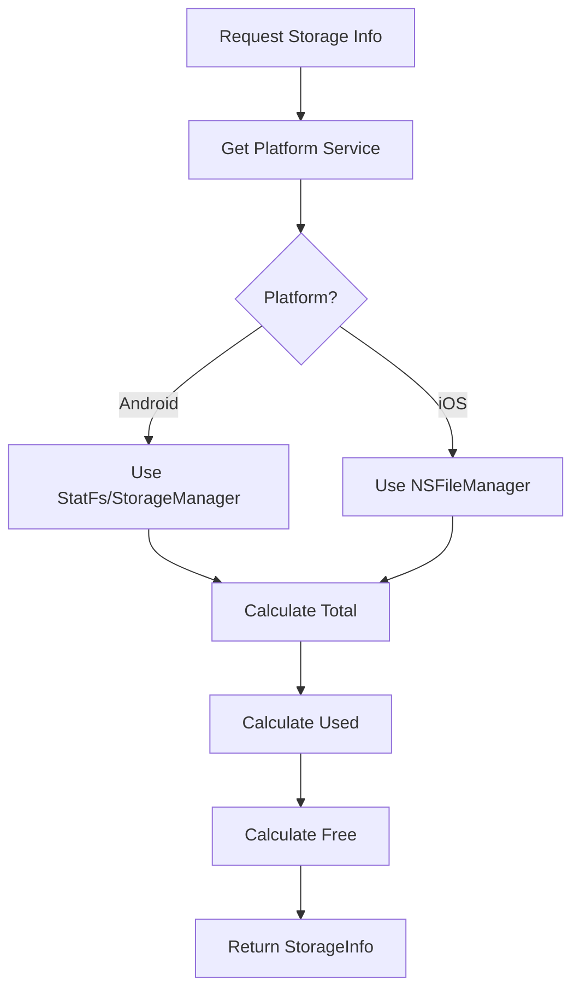

# Storage Info Documentation

This document describes storage information calculation and display.

## Features

### Storage Statistics
- Total storage space
- Used storage space
- Free storage space
- Directory size calculation

### Display
- Visual progress indicator
- Human-readable sizes (GB, MB, KB)
- Percentage used/free

## Implementation

Storage info is calculated using platform-specific APIs:

### Android
- Uses `StatFs` or `StorageManager` APIs
- Calculates total, used, and free space

### iOS
- Uses `NSFileManager` attributes
- Gets file system attributes for storage calculation

## Calculation Process

## Directory Size Calculation

Directory sizes are calculated asynchronously:
- Recursive traversal of all subdirectories
- Sum of all file sizes
- Cached for performance
- Updated on file operations

## Caching Strategy

- Cache storage info for short duration
- Invalidate cache on file operations
- Refresh on app resume
- Background calculation for large directories

## Performance Considerations

- **Async Calculation**: Directory sizes calculated asynchronously
- **Caching**: Results cached to avoid recalculation
- **Progressive Updates**: Show partial results while calculating
- **Cancellation**: Can cancel long-running calculations

## Display Format

Storage info is displayed with:
- Total: "X.XX GB"
- Used: "X.XX GB (XX%)"
- Free: "X.XX GB (XX%)"
- Visual progress bar

