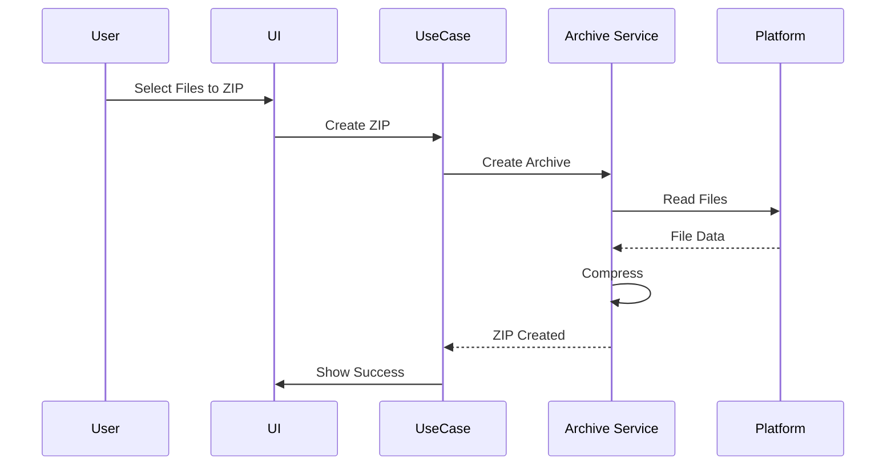

# ZIP Support Documentation

This document describes ZIP creation and extraction functionality.

## Features

### ZIP Creation
- Create ZIP archives from selected files
- Support for multiple files and directories
- Recursive directory inclusion

### ZIP Extraction
- Extract ZIP archives to specified directory
- Preserve directory structure
- Progress tracking for large archives

## Implementation

ZIP operations use the `flutter_archive` package:

```dart
// Create ZIP
await ZipFile.createFromFiles(
  sourceDir: Directory(sourcePath),
  zipFile: File(zipPath),
  files: fileList,
);

// Extract ZIP
await ZipFile.extractToDirectory(
  zipFile: File(zipPath),
  destinationDir: Directory(destPath),
);
```

## Operation Flow



## Error Handling

- **Corrupt ZIP**: Safe abort with error message
- **Disk Space**: Check available space before operation
- **Permission Errors**: Handle file access restrictions
- **Progress Tracking**: Show progress for large operations

## Progress Tracking

For large archives, progress is tracked and displayed:
- Percentage complete
- Files processed
- Estimated time remaining

## Limitations

- ZIP format only (no RAR, 7z, etc.)
- Large files may take significant time
- Memory usage scales with archive size

